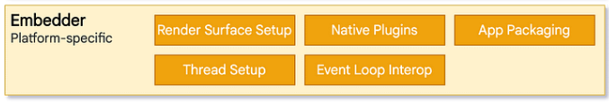
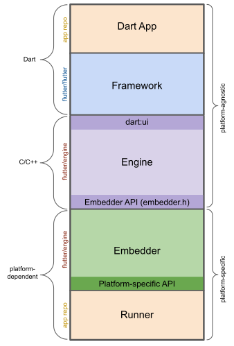

# Funcionamiento de Flutter

Flutter es un kit de herramientas de interfaz de usuario multiplataforma que permite que las aplicaciones interactúen directamente con los servicios de la plataforma subyacente al tiempo que permite la reutilización del código en sistemas operativos como iOS, Android, WebOS, etc.

# Capas arquitectónicas
## Embedder layer (capa de incrustación)

El Embedding Layer (Capa de Incrustación) en Flutter se refiere a la parte del framework que interactúa con el sistema operativo o plataforma específica en la que se está ejecutando la aplicación Flutter. Esta capa es responsable de comunicarse con el sistema operativo para administrar las vistas nativas y el ciclo de vida de la aplicación. En otras palabras, es el puente entre el código de Flutter y el sistema subyacente en el que se está ejecutando.

Por ejemplo, cuando se ejecuta una aplicación Flutter en dispositivos móviles, la Embedding Layer se encarga de crear una vista nativa (como una View en Android o un UIView en iOS) para mostrar la interfaz de usuario creada en Flutter. También administra la interacción entre el código Flutter y los eventos y características nativas del sistema operativo.

## Engine (motor)

El Engine de Flutter se refiere al núcleo del framework que impulsa toda la funcionalidad y la magia detrás de la creación de interfaces de usuario en Flutter. El Engine incluye componentes esenciales como el motor de renderización gráfica (utilizando la biblioteca Skia), el tiempo de ejecución de Dart y la capa de framework que proporciona widgets y herramientas para construir interfaces de usuario.

El Engine es responsable de tomar el código de Dart escrito por los desarrolladores, procesarlo, renderizar la interfaz de usuario utilizando gráficos 2D de alto rendimiento y gestionar la lógica de la aplicación. Trabaja en conjunto con el Embedder Layer para lograr que las aplicaciones Flutter se ejecuten de manera eficiente y se integren con éxito en diversas plataformas.

## Framework

La capa de framework en Flutter es esencial para construir y diseñar la interfaz de usuario de una aplicación. Proporciona un conjunto robusto de widgets, herramientas y patrones de desarrollo que permiten a los desarrolladores crear interfaces de usuario atractivas y funcionales en múltiples plataformas de manera eficiente y coherente.

- **Dart App**
    - Compone widgets en la interfaz de usuario deseada.
    - Implementa la lógica de negocios.
    - Propiedad del desarrollador de la aplicación.
- **Framework**
    - Proporciona una API de nivel superior para crear aplicaciones de alta calidad (por ejemplo, widgets, pruebas de posicionamiento, detección de gestos, accesibilidad, entrada de texto).
    - Compone el árbol de widgets de la aplicación en una escena.
- **Engine**
    - Responsable de rasterizar escenas compuestas.
    - Proporciona una implementación de bajo nivel de las API principales de Flutter (por ejemplo, gráficos, diseño de texto, tiempo de ejecución de Dart).
    - Expone su funcionalidad al marco usando la **API dart:ui**        
    - Se integra con una plataforma específica usando la **API Embedder** de Engine
        
- **Embedder**
    - Se coordina con el sistema operativo subyacente para acceder a servicios como superficies de representación, accesibilidad y entrada.
    - Administra el bucle de eventos.
    - Expone **la API específica de la plataforma** para integrar el Embedder en las aplicaciones.
        
- **Runner**
    - Compone las piezas expuestas por la API específica de la plataforma de Embedder en un paquete de aplicación ejecutable en la plataforma de destino.
    - Parte de la plantilla de la aplicación generada por `flutter create`, propiedad del desarrollador de la aplicación.
        

## Funcionamiento en un caso hipotético

Supongamos que estamos desarrollando una aplicación de lista de tareas (To-Do List) en Flutter y planeamos desplegarla en dispositivos iOS y Android.

1. **Capa de Framework (Flutter):**
    - Creación de la Interfaz de Usuario: Utilizaríamos widgets proporcionados por la capa de framework para construir la interfaz de usuario de la aplicación. Esto incluiría la creación de listas de tareas, elementos de lista, botones, cajas de texto, etc.
    - Diseño y Personalización: Configuramos y personalizamos los widgets para lograr el aspecto y la sensación deseados de la aplicación.
    - Implementación de Animaciones: Utilizaríamos las APIs de animación de Flutter para agregar transiciones y animaciones atractivas a la interfaz de usuario.
2. **Capa de Engine (Flutter Engine):**
    - Renderización Visual: El motor de renderización de Flutter (Skia) renderizaría los widgets y la interfaz de usuario en gráficos 2D de alta calidad en la pantalla del dispositivo.
    - Procesamiento de Lógica: El tiempo de ejecución de Dart en el Engine procesaría la lógica de la aplicación, como agregar, eliminar o editar tareas en la lista.
3. **Capa de Embedding (Embedder Layer):**
    - Integración con la Plataforma: La capa de incrustación se comunicaría con los sistemas operativos iOS y Android para crear ventanas nativas y vistas web (WebView) donde se mostraría la aplicación.
    - Gestión de Eventos: Capturaría eventos del sistema, como toques y gestos, y los transmitiría al código de Flutter para su procesamiento.
4. **Desarrollo y Pruebas:**
    - Codificación: Los desarrolladores escribirían el código de la aplicación utilizando Dart y aprovechando los widgets y las herramientas de la capa de framework.
    - Pruebas Unitarias y de Integración: Se crearían pruebas unitarias y de integración para asegurarse de que la lógica de la aplicación funcione correctamente.
5. **Despliegue:**
    - Empaquetado de la Aplicación: Utilizando las herramientas de Flutter, como el comando **`flutter build`**, se crearían los paquetes de la aplicación listos para el despliegue en dispositivos iOS y Android.
    - Publicación en Tiendas de Aplicaciones: La aplicación se enviaría a las tiendas de aplicaciones (App Store y Google Play) para su revisión y aprobación.
    

[Flutter architectural overview](https://docs.flutter.dev/resources/architectural-overview)